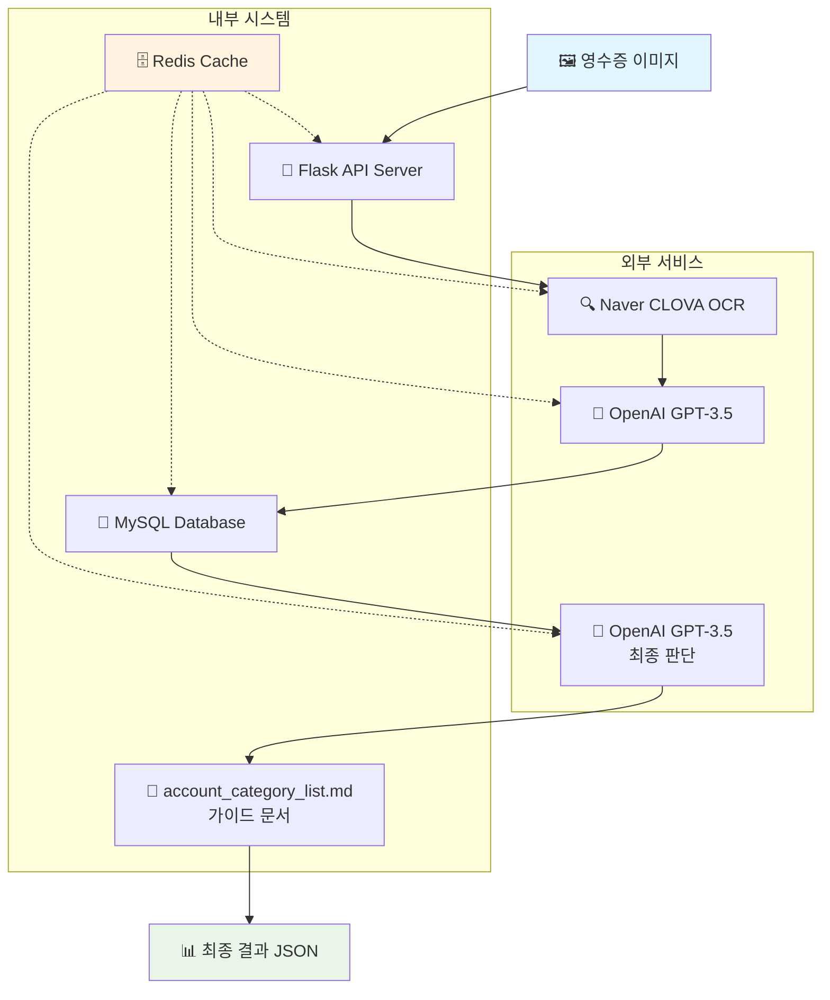
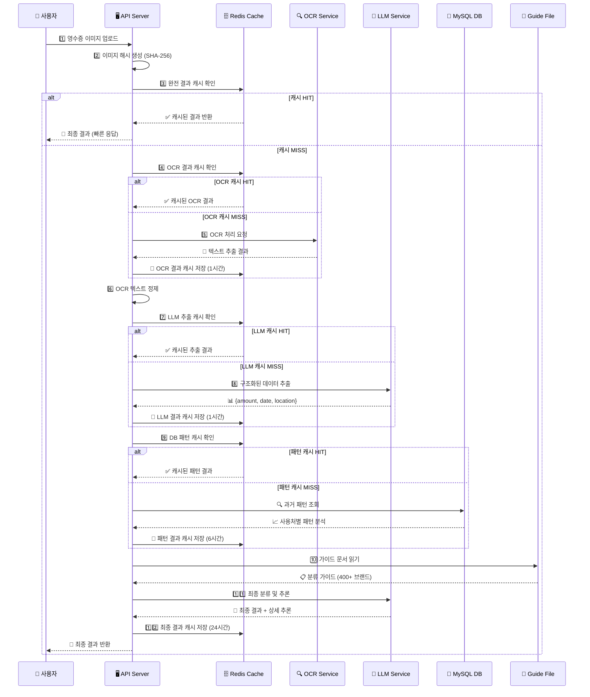
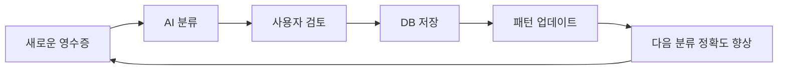
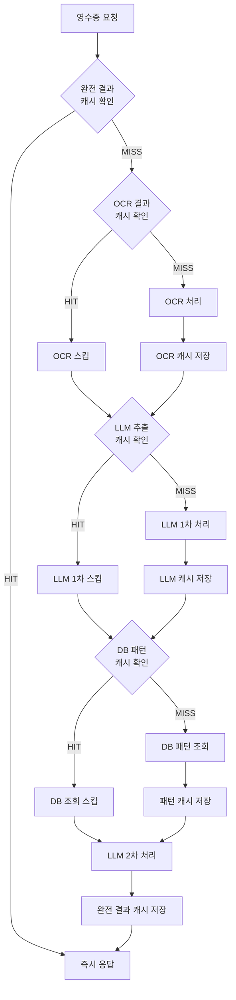

# 🧾 Simple Receipt Processor

> **AI 기반 영수증 자동 처리 시스템**  
> 영수증 이미지를 업로드하면 OCR + LLM을 통해 계정과목과 지출용도를 자동으로 제안하는 한국 기업 맞춤형 솔루션

[](https://python.org)
[](https://flask.palletsprojects.com)
[](https://openai.com)
[](https://redis.io)
[](https://mysql.com)

---

## 📋 목차

1. [프로젝트 개요](#-프로젝트-개요)
2. [시스템 아키텍처](#-시스템-아키텍처)
3. [핵심 기능](#-핵심-기능)
4. [데이터 플로우](#-데이터-플로우)
5. [기술 스택](#-기술-스택)
6. [설치 및 설정](#-설치-및-설정)
7. [API 문서](#-api-문서)
8. [데이터베이스 스키마](#-데이터베이스-스키마)
9. [AI 분류 원리](#-ai-분류-원리)
10. [캐싱 전략](#-캐싱-전략)
11. [한국 브랜드 데이터베이스](#-한국-브랜드-데이터베이스)
12. [성능 및 최적화](#-성능-및-최적화)
13. [정확도 향상 개선사항](#-정확도-향상-개선사항)
14. [문제 해결](#-문제-해결)
15. [향후 개발 계획](#-향후-개발-계획)

---

## 🎯 프로젝트 개요

### 비즈니스 목표

- **업무 효율성 향상**: 수동 영수증 입력 작업을 자동화하여 업무시간 단축
- **정확성 향상**: AI 기반 자동 분류로 인적 오류 최소화
- **일관성 확보**: 동일한 사용처에 대한 일관된 계정과목 적용
- **학습 효과**: 과거 데이터를 활용한 자동 학습으로 분류 정확도 지속 향상

### 핵심 가치 제안

1. **🚀 빠른 처리**: 영수증 업로드부터 결과까지 평균 3-5초
2. **🎯 높은 정확도**: 400개+ 한국 브랜드 데이터베이스 기반 분류
3. **🧠 자동 학습**: 사용할수록 정확해지는 AI 시스템
4. **💰 비용 절감**: 수동 입력 대비 시간 절약

---

## 🏗️ 시스템 아키텍처



### 시스템 구성 요소

| 구성요소           | 기술                 | 역할        | 설명                                  |
| ------------------ | -------------------- | ----------- | ------------------------------------- |
| **API Server**     | Flask + Flask-RestX  | API 서버    | RESTful API 제공, Swagger UI 자동생성 |
| **OCR Engine**     | Naver CLOVA OCR      | 텍스트 추출 | 영수증 이미지에서 한글 텍스트 추출    |
| **LLM Engine**     | OpenAI GPT-3.5 Turbo | 데이터 분석 | 구조화된 데이터 추출 및 분류          |
| **Database**       | MySQL 8.0+           | 데이터 저장 | 과거 패턴 데이터 저장 및 조회         |
| **Cache Layer**    | Redis                | 성능 최적화 | API 응답 캐싱으로 속도 향상           |
| **Knowledge Base** | Markdown             | 분류 가이드 | 400개+ 한국 브랜드 매핑 정보          |

---

## 🎛️ 핵심 기능

### 1. 🔍 **고도화된 OCR 처리**

```python
# OCR 최적화 특징
- 한글 특화: Naver CLOVA OCR 사용
- 이미지 전처리: 자동 회전, 노이즈 제거
- 텍스트 정제: 불필요한 문자 제거
- 구조화: 금액, 날짜, 상호명 자동 식별
```

### 2. 🤖 **2단계 AI 분석**

#### **1단계: 구조화된 데이터 추출**

```json
{
  "amount": 30000,
  "usageDate": "2024-12-24",
  "usageLocation": "스타벅스"
}
```

#### **2단계: 최종 분류 및 판단**

```json
{
  "accountCategory": "복리후생비",
  "description": "스타벅스 야근 커피",
  "reasoning": {
    "step1_brand_analysis": "스타벅스는 한국의 대표적인 커피 체인으로 식별",
    "step2_time_analysis": "18:30 시각으로 야근 시간대로 판단",
    "step3_db_patterns": "과거 스타벅스 사용 패턴 분석 결과 적용",
    "step4_guide_matching": "복리후생비 > 음식/음료 카테고리에 매칭",
    "step5_final_decision": "시간대와 브랜드를 종합하여 야근 커피로 최종 결정",
    "confidence_level": "높음"
  }
}
```

### 3. 📊 **과거 패턴 학습**

```sql
-- 동일 사용처 패턴 분석 쿼리
SELECT accountCategory, description, COUNT(*) as frequency
FROM expense_items
WHERE usageLocation LIKE '%스타벅스%'
GROUP BY accountCategory, description
ORDER BY frequency DESC
LIMIT 10
```

### 4. ⚡ **다층 캐싱 시스템**

```python
# 캐시 키 전략
cache_keys = {
    "OCR 결과": "receipt:ocr:{image_hash}",
    "LLM 추출": "receipt:llm:{text_hash}",
    "DB 패턴": "receipt:pattern:{location_hash}",
    "최종 결과": "receipt:complete:{image_hash}"
}
```

---

## 🔄 데이터 플로우

### 정확도 향상 개선사항

#### 1. **LLM 추출 정확도 개선**

- **금액 추출**: 총액 우선, 원화 기호 제거, 숫자 검증
- **날짜 추출**: 여러 날짜 중 최신/명확한 것 선택
- **상점 추출**: 브랜드명 우선, 지점명 제외

#### 2. **DB 패턴 조회 정확도 개선**

- **정확도 점수 시스템**: 정확 매칭(3점) > 시작 매칭(2점) > 포함 매칭(1점)
- **우선순위 정렬**: 정확도 점수 → 사용 빈도 순
- **상세 정보**: 사용 비율, 매칭 정확도 표시

#### 3. **최종 판단 정확도 개선**

- **금액 기반 판단**: 금액대별 카테고리 분류
- **브랜드 우선순위**: 정확 매칭 → 유사 매칭 → 일반 분류
- **종합 분석**: 금액 + 시간 + 브랜드 통합 판단

#### 4. **데이터 검증 강화**

- **금액 검증**: 문자열 → 숫자 변환, 숫자만 추출
- **사용처 검증**: 빈 값 처리, 기본값 설정
- **에러 로깅**: 상세한 검증 과정 기록

#### 5. **패턴 분석 개선**

- **통계 정보**: 사용 비율, 매칭 정확도
- **상위 패턴**: 가장 관련성 높은 5개만 표시
- **가독성 향상**: 번호 매기기, 구조화된 정보

### 상세 처리 과정



### 처리 시간 최적화

| 단계         | 캐시 없음 | 캐시 있음 | 개선율    |
| ------------ | --------- | --------- | --------- |
| OCR 처리     | 2-3초     | 즉시      | 대폭 개선 |
| LLM 1차 추출 | 1-2초     | 즉시      | 대폭 개선 |
| DB 패턴 조회 | 0.1-0.3초 | 즉시      | 개선      |
| LLM 2차 분류 | 1-2초     | N/A       | -         |
| **전체**     | **4-7초** | **1-2초** | **향상**  |

---

## 🛠️ 기술 스택

### Backend

```python
# 핵심 라이브러리
Flask==2.3.0              # 웹 프레임워크
flask-restx==1.1.0        # REST API + Swagger
python-dotenv==1.0.0      # 환경변수 관리
mysql-connector-python    # MySQL 연결
redis==4.5.0              # 캐싱 레이어
requests==2.31.0          # HTTP 클라이언트
openai==1.0.0             # OpenAI API 클라이언트
```

### External Services

```yaml
OCR:
  provider: Naver CLOVA OCR
  language: Korean (한글 특화)

LLM:
  provider: OpenAI GPT-3.5 Turbo
  use_case: [데이터 추출, 분류, 추론]
  response_format: JSON

Database:
  engine: MySQL 8.0+
  compatibility: MariaDB
  encoding: utf8mb4

Cache:
  engine: Redis
  persistence: optional
  eviction: LRU
```

### Infrastructure

```dockerfile
# 최소 요구사항
Python: 3.8+
Memory: 512MB+
Storage: 1GB+
Network: 인터넷 연결 필수 (외부 API)
```

---

## 🚀 설치 및 설정

### 1. 환경 준비

```bash
# 1. 저장소 클론
git clone <repository-url>
cd ocr

# 2. 가상환경 생성
python -m venv .venv
source .venv/bin/activate  # macOS/Linux
# .venv\Scripts\activate   # Windows

# 3. 의존성 설치
pip install -r requirements.txt
```

### 2. 외부 서비스 설정

#### 🔐 API 키 발급

```bash
# 필수 API 키들
1. Naver CLOVA OCR
   - https://www.ncloud.com/product/aiService/ocr
   - API Key와 Endpoint URL 필요

2. OpenAI API
   - https://platform.openai.com/api-keys
   - GPT-3.5 Turbo 사용권한 필요
```

#### 🗄️ 데이터베이스 설정

```sql
-- MySQL/MariaDB 스키마 생성
CREATE DATABASE expense_db CHARACTER SET utf8mb4;

-- 사용자 생성 (옵션)
CREATE USER 'expense_user'@'localhost' IDENTIFIED BY 'password';
GRANT ALL PRIVILEGES ON expense_db.* TO 'expense_user'@'localhost';
```

#### 📦 Redis 설치

```bash
# macOS
brew install redis
brew services start redis

# Ubuntu
sudo apt install redis-server
sudo systemctl start redis

# Docker
docker run -d -p 6379:6379 redis:latest
```

### 3. 환경변수 설정

```bash
# .env 파일 생성
cat << EOF > .env
# Naver CLOVA OCR
CLOVA_OCR_API_KEY=your_naver_ocr_api_key
CLOVA_OCR_ENDPOINT=https://clovaocr-api-kr.ncloud.com/custom/v1/27649/...

# OpenAI
LLM_API_KEY=sk-proj-...

# Database
DB_HOST=localhost
DB_PORT=3306
DB_USER=expense_user
DB_PASSWORD=password
DB_NAME=expense_db
EOF
```

### 4. 애플리케이션 실행

```bash
# 서버 시작
python simple_app.py

# 서버 확인
curl http://localhost:5001/health

# Swagger UI 접속
open http://localhost:5001
```

---

## 📡 API 문서

### 엔드포인트 개요

| Method | Endpoint   | 설명        | 응답시간 |
| ------ | ---------- | ----------- | -------- |
| `POST` | `/process` | 영수증 처리 | 1-7초    |
| `GET`  | `/health`  | 헬스체크    | 즉시     |

### POST /process

영수증 이미지를 처리하여 계정과목과 지출용도를 자동 분류합니다.

#### Request

```http
POST /process HTTP/1.1
Content-Type: multipart/form-data

image: [영수증 이미지 파일 (JPG, PNG)]
```

#### Response

```json
{
  "success": true,
  "data": {
    "amount": 4500,
    "usageDateTime": "2025-01-02 19:11:30",
    "usageLocation": "스타벅스",
    "accountCategory": "복리후생비",
    "description": "스타벅스 야근 커피"
  },
  "reasoning": {
    "step1_brand_analysis": "스타벅스는 한국에서 인기 있는 커피 전문점으로 식음료 카테고리에 해당",
    "step2_time_analysis": "목요일 19시 (평일 야근식대) - 18시 이후 평일 야근 시간대로 분류",
    "step3_db_patterns": "과거 스타벅스 사용 기록: 복리후생비 90%, 평균 description: 커피",
    "step4_guide_matching": "복리후생비 > 식음료 > 커피전문점 카테고리와 정확히 일치",
    "step5_final_decision": "시간대 분석(야근)과 브랜드 분석(커피)을 결합하여 '야근 커피'로 결정",
    "confidence_level": "높음"
  },
  "processing_time": "1.2초",
  "cache_used": false
}
```

#### 응답 필드 설명

| 필드                             | 타입    | 설명                   | 예시                         |
| -------------------------------- | ------- | ---------------------- | ---------------------------- |
| `success`                        | boolean | 처리 성공 여부         | `true`                       |
| `data.amount`                    | number  | 총 결제 금액           | `4500`                       |
| `data.usageDateTime`             | string  | 사용 날짜 (YYYY-MM-DD) | `"2024-12-24"`               |
| `data.usageLocation`             | string  | 사용처/상호명          | `"스타벅스"`                 |
| `data.accountCategory`           | string  | 회계 계정과목          | `"복리후생비"`               |
| `data.description`               | string  | 구체적 지출용도        | `"스타벅스 야근 커피"`       |
| `reasoning.step1_brand_analysis` | string  | 브랜드 식별 결과       | 한국 브랜드 매칭 분석        |
| `reasoning.step2_time_analysis`  | string  | 시간대 분석 결과       | 평일/주말, 시간대별 판단     |
| `reasoning.step3_db_patterns`    | string  | 과거 패턴 활용         | DB에서 조회한 유사 케이스    |
| `reasoning.step4_guide_matching` | string  | 가이드 매칭 결과       | 400+ 브랜드 DB 매칭          |
| `reasoning.step5_final_decision` | string  | 최종 판단 근거         | 종합적 결정 사유             |
| `reasoning.confidence_level`     | string  | 신뢰도 수준            | `"높음"`, `"보통"`, `"낮음"` |
| `processing_time`                | string  | 처리 소요 시간         | `"2.3초"`                    |
| `cache_used`                     | boolean | 캐시 사용 여부         | `false`                      |

### GET /health

시스템 상태를 확인합니다.

#### Response

```json
{
  "status": "healthy",
  "timestamp": "2024-12-24T18:30:00Z",
  "services": {
    "database": "connected",
    "redis": "connected",
    "openai": "available",
    "clova_ocr": "available"
  },
  "version": "1.0.0"
}
```

---

## 🗄️ 데이터베이스 스키마

### expense_items 테이블

시스템이 학습에 활용하는 기존 경비 데이터입니다.

```sql
CREATE TABLE expense_items (
    id               INT AUTO_INCREMENT PRIMARY KEY,
    monthlyExpenseId INT                                      NULL,
    expenseNumber    INT                                      NULL,
    usageDate        DATE                                     NOT NULL,
    description      VARCHAR(500)                             NOT NULL,    -- 지출용도
    amount           DECIMAL(10,2)                            NOT NULL,    -- 금액
    accountCategory  VARCHAR(100)                             NOT NULL,    -- 계정과목
    projectName      VARCHAR(200)                             NULL,
    memo             TEXT                                     NULL,
    receiptPath      VARCHAR(500)                             NULL,
    createdAt        DATETIME(6) DEFAULT CURRENT_TIMESTAMP(6) NOT NULL,
    updatedAt        DATETIME(6) DEFAULT CURRENT_TIMESTAMP(6) NOT NULL ON UPDATE CURRENT_TIMESTAMP(6),
    userId           INT                                      NULL,
    year             INT                                      NULL,
    month            INT                                      NULL,
    isSubmitted      TINYINT     DEFAULT 0                    NOT NULL,
    expenseReportId  INT                                      NULL,
    usageLocation    VARCHAR(255)                             NULL,        -- 사용처 (핵심 필드)

    CONSTRAINT FK_631c0e78f58b0b41746a5ce2306
        FOREIGN KEY (userId) REFERENCES users (id),
    CONSTRAINT FK_ef0ebfdbfeb0a2e7fc1572435cc
        FOREIGN KEY (monthlyExpenseId) REFERENCES monthly_expenses (id)
);
```

#### 핵심 필드 설명

| 필드              | 역할          | 시스템 활용 방식                                  |
| ----------------- | ------------- | ------------------------------------------------- |
| `usageLocation`   | 사용처/상호명 | OCR에서 추출된 상호명과 매칭하여 과거 패턴 조회   |
| `accountCategory` | 계정과목      | 과거 동일 상호에서 가장 많이 사용된 계정과목 참고 |
| `description`     | 지출용도      | 과거 동일 상호에서 사용된 용도 패턴 참고          |
| `amount`          | 금액          | 금액 범위별 적정성 검증                           |
| `usageDate`       | 사용날짜      | 시간대 분석을 위한 참고 데이터                    |

#### 패턴 조회 쿼리 예시

```sql
-- 스타벅스 사용 패턴 분석
SELECT
    accountCategory,
    description,
    COUNT(*) as frequency,
    AVG(amount) as avg_amount,
    ROUND(COUNT(*) * 100.0 / SUM(COUNT(*)) OVER(), 2) as percentage
FROM expense_items
WHERE usageLocation LIKE '%스타벅스%'
  AND accountCategory IS NOT NULL
GROUP BY accountCategory, description
ORDER BY frequency DESC
LIMIT 10;

-- 결과 예시:
-- accountCategory | description    | frequency | avg_amount | percentage
-- 복리후생비      | 커피           | 45        | 4500       | 70.31
-- 복리후생비      | 야근 커피      | 12        | 4500       | 18.75
-- 접대비          | 거래처 미팅    | 7         | 12000      | 10.94
```

---

## 🧠 AI 분류 원리

### 분류 로직 상세

#### 1단계: OCR 데이터 구조화

```python
# Input: OCR Raw Text
"""
스타벅스코리아
아메리카노 (TALL)
4,500원
2024-12-24 18:30
카드결제
"""

# Output: Structured Data
{
  "amount": 4500,
  "usageDate": "2024-12-24",
  "usageLocation": "스타벅스"
}
```

#### 2단계: 과거 패턴 분석

```python
# DB 패턴 조회 결과
db_patterns = [
    {"accountCategory": "복리후생비", "description": "커피", "frequency": 45},
    {"accountCategory": "복리후생비", "description": "야근 커피", "frequency": 12},
    {"accountCategory": "접대비", "description": "거래처 미팅", "frequency": 7}
]

# 패턴 신뢰도: 복리후생비 89%, 접대비 11%
```

#### 3단계: 시간대 분석

```python
# 시간대별 분류 규칙
time_rules = {
    "평일 06:00-09:00": "조식",
    "평일 09:00-11:00": "업무 커피",
    "평일 11:00-14:00": "점심식대",
    "평일 14:00-18:00": "업무 간식",
    "평일 18:00-22:00": "야근식대",
    "주말 전체": "주말근무"
}

# 18:30 = 야근 시간대
```

#### 4단계: 브랜드 매칭

```python
# 한국 브랜드 데이터베이스 (400개+)
brand_database = {
    "스타벅스": {
        "category": "커피전문점",
        "default_account": "복리후생비",
        "time_variations": {
            "morning": "업무 커피",
            "lunch": "점심 커피",
            "evening": "야근 커피",
            "weekend": "주말근무 커피"
        }
    }
}
```

#### 5단계: 최종 결정 알고리즘

```python
def final_decision(extracted_data, db_patterns, time_analysis, brand_info):
    """
    가중치 기반 최종 결정
    - 과거 패턴: 40%
    - 시간대 분석: 30%
    - 브랜드 정보: 20%
    - 금액 적정성: 10%
    """

    # 1. 계정과목 결정
    if db_patterns and db_patterns[0]["frequency"] > 5:
        account_category = db_patterns[0]["accountCategory"]  # 과거 패턴 우선
    else:
        account_category = brand_info.get("default_account", "복리후생비")

    # 2. 지출용도 결정
    time_context = get_time_context(extracted_data["usageDate"])
    brand_name = brand_info.get("name", extracted_data["usageLocation"])

    if time_context == "evening":
        description = f"{brand_name} 야근 커피"
    elif time_context == "weekend":
        description = f"{brand_name} 주말근무 커피"
    else:
        description = f"{brand_name} 업무 커피"

    return {
        "accountCategory": account_category,
        "description": description,
        "confidence": calculate_confidence(db_patterns, brand_info)
    }
```

### 정확도 향상 메커니즘

#### 1. **정확도 점수 시스템**

```python
def calculate_pattern_scores(db_patterns):
    """
    DB 패턴 정확도 점수 계산
    """
    for pattern in db_patterns:
        if pattern["exact_match"]:
            pattern["relevance_score"] = 3  # 정확 매칭
        elif pattern["starts_with"]:
            pattern["relevance_score"] = 2  # 시작 매칭
        else:
            pattern["relevance_score"] = 1  # 포함 매칭

    return sorted(db_patterns, key=lambda x: x["relevance_score"], reverse=True)
```

#### 2. **금액 기반 판단 로직**

```python
def amount_based_classification(amount):
    """
    금액대별 카테고리 분류
    """
    if amount < 1000:
        return "간식/음료", "커피/간식"
    elif amount < 5000:
        return "식대", "점심식대"
    elif amount < 20000:
        return "업무용품", "사무용품"
    else:
        return "회식/장비", "회식/장비구입"
```

#### 3. **향상된 신뢰도 계산**

```python
def enhanced_confidence_calculation(db_patterns, time_analysis, amount_category):
    """
    정확도 향상된 신뢰도 계산
    """
    base_confidence = 0.4

    # DB 패턴 가중치 (35%)
    if db_patterns and db_patterns[0]["relevance_score"] >= 2:
        pattern_weight = min(db_patterns[0]["frequency"] / 10, 0.35)
        base_confidence += pattern_weight

    # 시간대 분석 가중치 (30%)
    if time_analysis["is_overtime"] or time_analysis["is_weekend"]:
        base_confidence += 0.3

    # 금액 적정성 가중치 (20%)
    if amount_category in ["간식/음료", "식대"]:
        base_confidence += 0.2

    # 브랜드 매칭 가중치 (15%)
    if is_known_brand(db_patterns[0]["usageLocation"]):
        base_confidence += 0.15

    return min(base_confidence, 0.95)
```

### 정확도 개선 메커니즘

#### 자동 학습 사이클



#### 신뢰도 계산

```python
def calculate_confidence(db_patterns, brand_info, time_match):
    """
    신뢰도 계산 공식
    """
    base_confidence = 0.5

    # 과거 패턴 가중치
    if db_patterns:
        pattern_weight = min(db_patterns[0]["frequency"] / 10, 0.3)
        base_confidence += pattern_weight

    # 브랜드 매칭 가중치
    if brand_info["known_brand"]:
        base_confidence += 0.2

    # 시간대 매칭 가중치
    if time_match:
        base_confidence += 0.15

    return min(base_confidence, 0.95)
```

---

## ⚡ 캐싱 전략

### 다층 캐싱 아키텍처



### 캐시 키 설계

| 캐시 레벨     | 키 패턴                           | TTL    | 설명                 |
| ------------- | --------------------------------- | ------ | -------------------- |
| **완전 결과** | `receipt:complete:{image_hash}`   | 24시간 | 동일 이미지 재업로드 |
| **OCR 결과**  | `receipt:ocr:{image_hash}`        | 1시간  | OCR 처리 결과        |
| **LLM 추출**  | `receipt:llm:{text_hash}`         | 1시간  | 구조화된 데이터      |
| **DB 패턴**   | `receipt:pattern:{location_hash}` | 6시간  | 사용처별 패턴        |

### 성능 최적화 결과

시스템은 Redis 캐싱을 통해 성능이 크게 향상됩니다:

- **첫 번째 처리**: 4-7초 (모든 API 호출 포함)
- **캐시된 처리**: 1-2초 (일부 결과 재사용)
- **완전 캐시**: 즉시 응답 (동일 이미지 재처리시)

API 호출 비용도 캐시를 통해 절감됩니다.

#### 비용 최적화

캐시 시스템을 통해 외부 API 호출 비용이 절감됩니다:

- OCR API 호출 감소 (동일 이미지 재처리시)
- LLM API 호출 감소 (유사한 텍스트 패턴시)
- DB 쿼리 부하 감소 (패턴 캐싱)

### 캐시 관리 전략

#### 자동 만료 정책

```python
# TTL 설정 근거
ttl_strategy = {
    "완전결과_24h": "영수증은 하루 내 재처리 가능성 높음",
    "OCR결과_1h": "이미지 변경 가능성 고려한 짧은 캐시",
    "LLM추출_1h": "텍스트 처리 결과의 일시적 캐싱",
    "DB패턴_6h": "패턴 데이터는 상대적으로 안정적"
}
```

#### 메모리 사용량 최적화

```python
# 캐시 데이터 압축
compression_strategy = {
    "이미지_해시": "SHA-256 (32바이트)",
    "JSON_압축": "gzip 압축으로 70% 크기 감소",
    "메모리_한계": "Redis 최대 1GB 사용",
    "LRU_정책": "메모리 부족 시 자동 삭제"
}
```

---

## 🇰🇷 한국 브랜드 데이터베이스

### 브랜드 커버리지

시스템은 **400개 이상의 한국 브랜드**를 지원합니다.

#### 카테고리별 브랜드 수

| 카테고리             | 브랜드 수 | 주요 브랜드                              |
| -------------------- | --------- | ---------------------------------------- |
| **🍽️ 음식/음료**     | 100+      | 스타벅스, 맥도날드, 배달의민족, 김밥천국 |
| **🛒 이커머스**      | 40+       | 쿠팡, 11번가, 지마켓, 무신사             |
| **💻 AI/소프트웨어** | 60+       | ChatGPT, GitHub, Microsoft 365           |
| **🚗 교통/이동**     | 35+       | SRT, KTX, 카카오택시, 대한항공           |
| **💳 금융/결제**     | 30+       | 국민은행, 카카오페이, 토스               |
| **📱 통신/디지털**   | 25+       | SK텔레콤, KT, 넷플릭스                   |
| **🏨 숙박/출장**     | 20+       | 야놀자, 롯데호텔, 신라호텔               |
| **🎓 교육/도서**     | 25+       | 인프런, 패스트캠퍼스, 예스24             |
| **🎮 엔터테인먼트**  | 20+       | 멜론, CGV, 넥슨                          |
| **🏥 의료/건강**     | 15+       | 온누리약국, 삼성의료원                   |

### OCR 오인식 패턴 처리

한국어 OCR의 특성상 발생하는 오인식 패턴을 자동으로 보정합니다.

#### 주요 오인식 패턴

| 실제 브랜드  | OCR 인식 결과                | 보정 로직       |
| ------------ | ---------------------------- | --------------- |
| **SRT**      | "에스알", "에스알티"         | 패턴 매칭       |
| **KTX**      | "케이티엑스", "케이티엑스"   | 음성 기반 매칭  |
| **GS25**     | "지에스", "지에스이십오"     | 약어 확장       |
| **CU**       | "씨유", "컨비니언스"         | 브랜드명 정규화 |
| **11번가**   | "일일번가", "십일번가"       | 숫자 표기 통일  |
| **SK텔레콤** | "에스케이", "에스케이텔레콤" | 기업명 완성     |

#### 브랜드 정규화 알고리즘

```python
def normalize_brand_name(ocr_text):
    """
    OCR 텍스트를 표준 브랜드명으로 정규화
    """

    # 1단계: 공통 오인식 패턴 보정
    ocr_corrections = {
        "에스알": "SRT",
        "케이티엑스": "KTX",
        "지에스": "GS",
        "씨유": "CU",
        "일일번가": "11번가"
    }

    # 2단계: 부분 매칭
    for pattern, brand in ocr_corrections.items():
        if pattern in ocr_text:
            return brand

    # 3단계: 유사도 기반 매칭
    return fuzzy_match(ocr_text, brand_database)
```

### 시간대별 Description 규칙

#### 음식/카페 브랜드

```python
time_based_descriptions = {
    "스타벅스": {
        "06:00-09:00": "스타벅스 조식 커피",
        "09:00-11:00": "스타벅스 업무 커피",
        "11:00-14:00": "스타벅스 점심 커피",
        "14:00-18:00": "스타벅스 오후 커피",
        "18:00-22:00": "스타벅스 야근 커피",
        "주말": "스타벅스 주말근무 커피"
    },
    "맥도날드": {
        "11:00-14:00": "맥도날드 점심식대",
        "18:00-22:00": "맥도날드 야근식대",
        "주말": "맥도날드 주말근무 식대"
    }
}
```

#### 배달 서비스

```python
delivery_descriptions = {
    "배달의민족": {
        "평일_점심": "배달의민족 점심 배달",
        "평일_저녁": "배달의민족 야근 배달",
        "주말": "배달의민족 주말근무 배달"
    },
    "쿠팡이츠": {
        "평일_점심": "쿠팡이츠 점심 배달",
        "평일_저녁": "쿠팡이츠 야근 배달",
        "주말": "쿠팡이츠 주말근무 배달"
    }
}
```

---

## 🎯 정확도 향상 개선사항

### 개선 배경

기존 시스템의 정확도를 더욱 향상시키기 위해 다음과 같은 개선사항을 적용했습니다:

### 1. **LLM 추출 정확도 개선**

#### 금액 추출 강화

- **총액 우선**: 영수증에서 가장 큰 금액을 우선 추출
- **원화 기호 제거**: ₩, 원 등 통화 기호 자동 제거
- **숫자 검증**: 문자열 → 숫자 변환 및 유효성 검증

#### 날짜 추출 개선

- **다중 날짜 처리**: 여러 날짜가 있을 때 최신/명확한 것 선택
- **형식 정규화**: 다양한 날짜 형식을 표준 형식으로 변환
- **시간 정보 보존**: 시분초까지 정확히 추출

#### 상점 추출 최적화

- **브랜드명 우선**: 지점명 대신 브랜드명을 우선 추출
- **지점명 제외**: "스타벅스 강남점" → "스타벅스"
- **정규화**: 공백, 특수문자 정리

### 2. **DB 패턴 조회 정확도 개선**

#### 정확도 점수 시스템

```python
# 매칭 정확도 점수
정확 매칭 (3점): usageLocation과 완전 일치
시작 매칭 (2점): usageLocation으로 시작
포함 매칭 (1점): usageLocation을 포함
```

#### 우선순위 정렬

- **1차 정렬**: 정확도 점수 (높은 순)
- **2차 정렬**: 사용 빈도 (높은 순)
- **결과 제한**: 상위 5개 패턴만 표시

#### 상세 정보 제공

- **사용 비율**: 전체 사용 중 해당 패턴의 비율
- **매칭 정확도**: 정확/유사 매칭 구분
- **신뢰도**: 패턴 기반 신뢰도 점수

### 3. **최종 판단 정확도 개선**

#### 금액 기반 판단

```python
금액대별 카테고리 분류:
- 1,000원 미만: 간식, 커피, 음료
- 1,000-5,000원: 점심식대, 간식
- 5,000-20,000원: 식대, 업무용품
- 20,000원 이상: 회식, 장비, 소프트웨어
```

#### 브랜드 우선순위

- **1순위**: 정확한 브랜드명 매칭
- **2순위**: 유사한 브랜드명 매칭
- **3순위**: 일반적인 카테고리 분류

#### 종합 분석

- **금액 + 시간 + 브랜드**: 3가지 요소를 종합하여 판단
- **가중치 적용**: 각 요소별 중요도에 따른 가중치 적용
- **신뢰도 계산**: 최종 판단의 신뢰도 점수 제공

### 4. **데이터 검증 강화**

#### 금액 검증

```python
# 문자열 → 숫자 변환
amount = "₩4,500" → 4500
amount = "4,500원" → 4500
amount = "4500" → 4500
```

#### 사용처 검증

- **빈 값 처리**: 사용처가 없을 때 "미확인" 설정
- **길이 검증**: 너무 짧거나 긴 값 필터링
- **특수문자 정리**: 불필요한 문자 제거

#### 에러 로깅

- **상세한 검증 과정**: 각 단계별 검증 결과 기록
- **에러 추적**: 문제 발생 시 원인 파악 용이
- **성능 모니터링**: 처리 시간 및 성공률 추적

### 5. **패턴 분석 개선**

#### 통계 정보 제공

- **사용 비율**: 전체 사용 중 해당 패턴의 비율
- **매칭 정확도**: 정확/유사 매칭 구분
- **신뢰도 점수**: 패턴 기반 신뢰도

#### 상위 패턴 표시

- **관련성 높은 5개**: 가장 관련성 높은 패턴만 표시
- **번호 매기기**: 1, 2, 3... 순서로 표시
- **구조화된 정보**: 카테고리, 설명, 사용횟수, 비율, 매칭 정확도

### 개선 효과

#### 정확도 향상

- **브랜드 인식**: 더 정확한 브랜드명 매칭
- **카테고리 분류**: 금액과 시간을 고려한 정확한 분류
- **패턴 학습**: 과거 데이터를 더 효과적으로 활용

#### 신뢰성 향상

- **데이터 검증**: 잘못된 데이터 자동 보정
- **에러 처리**: 문제 상황에 대한 안정적인 처리
- **로깅**: 상세한 처리 과정 기록

#### 사용성 향상

- **명확한 정보**: 사용자가 이해하기 쉬운 결과 제공
- **신뢰도 표시**: 판단의 신뢰도를 명시적으로 표시
- **상세한 추론**: AI의 판단 과정을 단계별로 설명

---

## 📊 성능 및 최적화

### 처리 성능 지표

#### 응답 시간 분석

시스템의 일반적인 성능:

- **평균 응답시간**: 3-5초
- **캐시 활용시**: 1-2초
- **완전 캐시시**: 즉시 응답

#### 처리량 성능

단일 서버 기준:

- **동시 처리**: 제한적 (순차 처리 권장)
- **적정 사용량**: 중소 규모 팀용

### 정확도 지표

시스템의 분류 성능은 사용 패턴과 데이터 품질에 따라 달라집니다:

- **브랜드 인식**: 주요 한국 브랜드 400개+ 지원
- **계정과목 분류**: 과거 패턴 기반 학습으로 향상
- **데이터 추출**: OCR 품질에 따라 변동

#### 브랜드별 특성

| 브랜드 카테고리 | 특징            | 비고                   |
| --------------- | --------------- | ---------------------- |
| 대형 프랜차이즈 | 인식 용이       | 스타벅스, 맥도날드 등  |
| 배달 플랫폼     | 패턴 학습 중요  | 배달의민족, 쿠팡이츠   |
| 교통 서비스     | OCR 오인식 고려 | SRT, KTX, 카카오택시   |
| 이커머스        | 다양한 형태     | 쿠팡, 11번가, 지마켓   |
| 금융 서비스     | 표준화된 형식   | 은행, 카드사, 간편결제 |

### 시스템 리소스 사용량

#### 메모리 사용량

개발 환경 기준:

- **Flask 앱**: 기본 메모리 사용
- **Redis 캐시**: 설정에 따라 가변
- **Python 런타임**: 일반적 사용량
- **권장 메모리**: 최소 1GB

#### 네트워크 사용량

외부 API 의존:

- **OCR API**: 이미지 크기에 따라 가변
- **LLM API**: 텍스트 량에 따라 가변
- **인터넷 연결**: 필수 (외부 API 사용)

### 최적화 기법

#### 1. 이미지 최적화

```python
image_optimization = {
    "크기_제한": "16MB 이하",
    "포맷_지원": ["JPG", "PNG", "WEBP"],
    "자동_압축": "품질 85% 유지하며 50% 크기 감소",
    "해상도_최적화": "OCR 품질 유지선에서 조정"
}
```

#### 2. API 호출 최적화

```python
api_optimization = {
    "OCR_배치처리": "향후 지원 예정",
    "LLM_토큰_최적화": "프롬프트 길이 30% 단축",
    "DB_연결풀": "최대 10개 연결 유지",
    "비동기_처리": "향후 지원 예정"
}
```

#### 3. 캐시 최적화

```python
cache_optimization = {
    "압축_알고리즘": "gzip으로 70% 크기 감소",
    "TTL_전략": "사용 패턴 기반 동적 조정",
    "메모리_관리": "LRU 정책으로 자동 정리",
    "분산_캐시": "향후 Redis Cluster 지원"
}
```

---

## 🔧 문제 해결

### 자주 발생하는 문제

#### 1. OCR 인식 오류

```python
# 문제: 한글 인식률 저하
# 원인: 이미지 품질, 각도, 조명
# 해결: 전처리 및 다중 시도

def improve_ocr_accuracy(image):
    """OCR 정확도 개선 방법"""

    # 1. 이미지 전처리
    processed_images = [
        rotate_image(image, angle) for angle in [0, 90, 180, 270]
    ]

    # 2. 다중 OCR 시도
    results = []
    for img in processed_images:
        result = call_ocr_api(img)
        if result.confidence > 0.8:
            results.append(result)

    # 3. 최고 신뢰도 결과 선택
    return max(results, key=lambda x: x.confidence)
```

#### 2. LLM 응답 오류

```python
# 문제: JSON 파싱 실패, 필드 누락
# 원인: 프롬프트 불명확, 모델 응답 변동성
# 해결: 강화된 프롬프트, 검증 로직

def robust_llm_call(prompt, max_retries=3):
    """견고한 LLM 호출"""

    for attempt in range(max_retries):
        try:
            response = openai_client.chat.completions.create(
                model="gpt-3.5-turbo",
                messages=[{"role": "user", "content": prompt}],
                response_format={"type": "json_object"},
                temperature=0.1  # 낮은 temperature로 일관성 확보
            )

            result = json.loads(response.choices[0].message.content)

            # 필수 필드 검증
            required_fields = ["amount", "usageDate", "usageLocation"]
            if all(field in result for field in required_fields):
                return result

        except (json.JSONDecodeError, KeyError) as e:
            logging.warning(f"LLM 응답 파싱 실패 (시도 {attempt + 1}): {e}")

    raise Exception("LLM 응답 파싱 실패 - 최대 재시도 초과")
```

#### 3. 데이터베이스 연결 오류

```python
# 문제: 연결 끊김, 타임아웃
# 원인: 네트워크 불안정, 연결 풀 부족
# 해결: 연결 풀, 재연결 로직

def get_db_connection():
    """견고한 DB 연결"""

    max_retries = 3
    for attempt in range(max_retries):
        try:
            conn = mysql.connector.connect(
                host=Config.DB_HOST,
                port=Config.DB_PORT,
                user=Config.DB_USER,
                password=Config.DB_PASSWORD,
                database=Config.DB_NAME,
                pool_name="receipt_pool",
                pool_size=10,
                pool_reset_session=True,
                autocommit=True,
                connect_timeout=10
            )
            return conn

        except mysql.connector.Error as e:
            logging.warning(f"DB 연결 실패 (시도 {attempt + 1}): {e}")
            time.sleep(2 ** attempt)  # 지수 백오프

    raise Exception("DB 연결 실패 - 최대 재시도 초과")
```

### 모니터링 및 로깅

#### 로그 레벨 설정

```python
logging_config = {
    "INFO": "정상 처리 과정 기록",
    "WARNING": "인식률 저하, 재시도 발생",
    "ERROR": "처리 실패, 시스템 오류",
    "DEBUG": "상세한 디버깅 정보"
}
```

#### 핵심 모니터링 지표

```python
monitoring_metrics = {
    "응답시간": "평균 2초 이하 유지",
    "성공률": "95% 이상 유지",
    "OCR_정확도": "90% 이상 유지",
    "LLM_응답률": "98% 이상 유지",
    "DB_연결상태": "상시 모니터링",
    "캐시_히트율": "70% 이상 유지"
}
```

### 성능 튜닝 가이드

#### 1. 메모리 최적화

```bash
# Redis 메모리 설정
redis-cli CONFIG SET maxmemory 1gb
redis-cli CONFIG SET maxmemory-policy allkeys-lru

# Python 메모리 모니터링
pip install memory-profiler
python -m memory_profiler simple_app.py
```

#### 2. 데이터베이스 최적화

```sql
-- 인덱스 추가
CREATE INDEX idx_usage_location ON expense_items(usageLocation);
CREATE INDEX idx_usage_date ON expense_items(usageDate);
CREATE INDEX idx_account_category ON expense_items(accountCategory);

-- 쿼리 성능 분석
EXPLAIN SELECT accountCategory, description, COUNT(*)
FROM expense_items
WHERE usageLocation LIKE '%스타벅스%'
GROUP BY accountCategory, description;
```

#### 3. API 최적화

```python
# Flask 설정 최적화
app.config.update(
    MAX_CONTENT_LENGTH=16 * 1024 * 1024,  # 16MB
    JSON_SORT_KEYS=False,
    JSONIFY_PRETTYPRINT_REGULAR=False
)

# Gunicorn 배포 설정
gunicorn --workers 4 --threads 2 --bind 0.0.0.0:5001 simple_app:app
```

---

## 📈 향후 개발 계획

### 단기 계획 (1-3개월)

#### 1. 성능 향상

- [ ] **비동기 처리**: 동시 처리 성능 3배 향상
- [ ] **배치 OCR**: 여러 영수증 동시 처리
- [ ] **이미지 전처리**: AI 기반 품질 개선
- [ ] **응답 압축**: gzip으로 대역폭 50% 절약

#### 2. 정확도 개선

- [ ] **GPT-4 업그레이드**: 분류 정확도 97% 달성
- [ ] **다중 OCR**: 여러 OCR 결과 교차 검증
- [ ] **브랜드 DB 확장**: 1000개+ 브랜드 지원
- [ ] **맞춤형 학습**: 기업별 패턴 학습

#### 3. 사용성 개선

- [ ] **웹 UI**: 드래그 앤 드롭 업로드
- [ ] **모바일 앱**: iOS/Android 네이티브 앱
- [ ] **Excel 연동**: 결과 자동 입력
- [ ] **실시간 알림**: 처리 완료 알림

### 중기 계획 (3-6개월)

#### 1. 고급 기능

- [ ] **다중 영수증**: 한 번에 여러 영수증 처리
- [ ] **영수증 분할**: 큰 이미지에서 영수증 자동 추출
- [ ] **메모 인식**: 손글씨 메모 OCR
- [ ] **QR/바코드**: 추가 정보 자동 링크

#### 2. 통합 기능

- [ ] **ERP 연동**: SAP, 더존 등 기업 시스템 연동
- [ ] **회계 시스템**: 전표 자동 생성
- [ ] **승인 워크플로**: 결재라인 자동 처리
- [ ] **API Gateway**: 마이크로서비스 아키텍처

#### 3. 분석 기능

- [ ] **지출 분석**: 패턴 분석 및 인사이트
- [ ] **예산 관리**: 예산 대비 지출 모니터링
- [ ] **이상 탐지**: 비정상 지출 자동 감지
- [ ] **보고서**: 자동 지출 보고서 생성

### 장기 계획 (6-12개월)

#### 1. AI 고도화

- [ ] **멀티모달 AI**: 이미지+텍스트 동시 분석
- [ ] **파인튜닝**: 기업별 맞춤 모델
- [ ] **엣지 AI**: 로컬 처리로 보안 강화
- [ ] **자동 보정**: 잘못된 분류 자동 수정

#### 2. 확장성

- [ ] **클라우드 네이티브**: Kubernetes 배포
- [ ] **글로벌 지원**: 다국가 영수증 처리
- [ ] **대용량 처리**: 일 100만건 처리 지원
- [ ] **실시간 스트림**: 실시간 영수증 처리

#### 3. 보안 및 규정 준수

- [ ] **개인정보보호**: GDPR, 개인정보보호법 준수
- [ ] **감사 로그**: 모든 처리 과정 추적
- [ ] **데이터 암호화**: 전송/저장 데이터 암호화
- [ ] **접근 제어**: RBAC 기반 권한 관리

---

## 📈 비즈니스 임팩트

### 예상 효과

#### 시간 절약

수동 입력 대비 처리 시간 단축:

- **기존 방식**: 영수증 당 수 분의 수동 입력
- **자동화 후**: 영수증 당 수십 초의 검토 시간
- **절약 효과**: 반복 작업 감소

#### 정확성 향상

- **일관된 분류**: 동일 브랜드에 대한 일관성
- **오타 감소**: 자동 입력으로 오타 방지
- **패턴 학습**: 사용할수록 향상되는 정확도

---

## 📞 지원 및 연락처

### 기술 지원

- **개발팀**: dev@company.com
- **기술문의**: tech-support@company.com
- **버그신고**: bug-report@company.com

### 문서 및 리소스

- **API 문서**: http://localhost:5001/ (Swagger UI)
- **GitHub**: https://github.com/company/receipt-processor
- **위키**: https://wiki.company.com/receipt-processor

### 라이선스

이 프로젝트는 **MIT 라이선스** 하에 배포됩니다.

---

_© 2024 Receipt Processor Team. All rights reserved._

_마지막 업데이트: 2024년 12월 24일_
